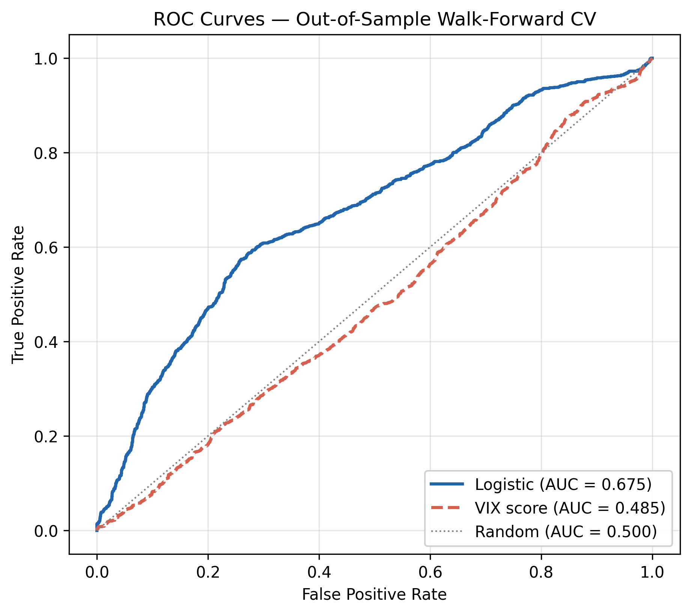
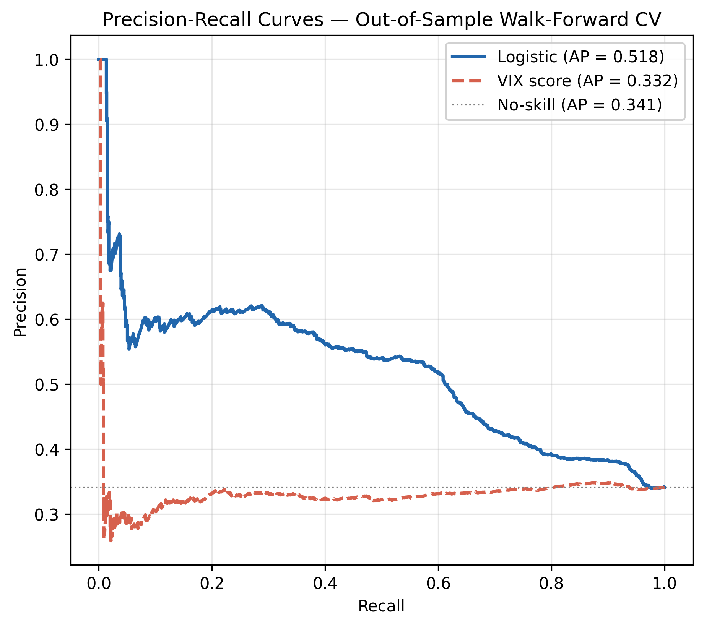
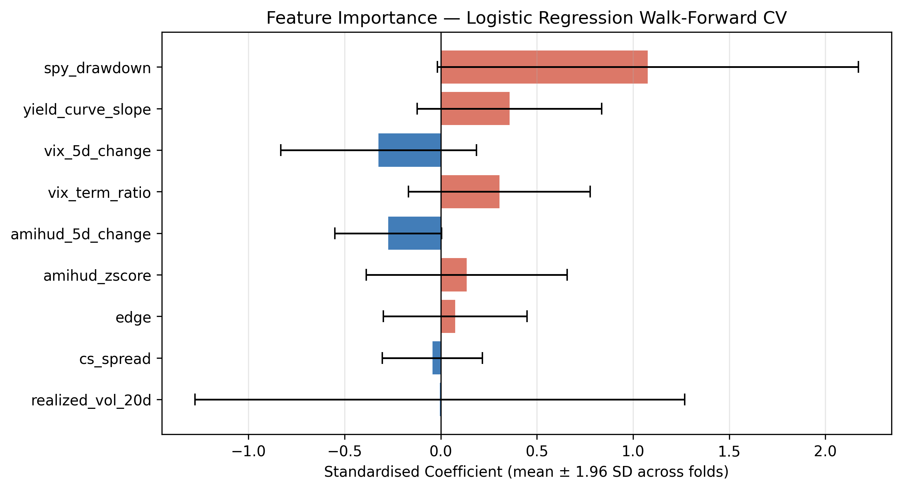
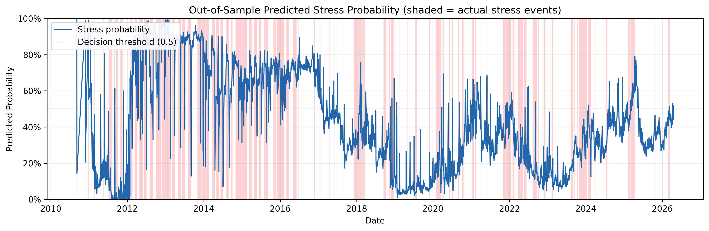

# 📡 Liquidity Stress Radar

**An interpretable, walk-forward-validated monitor for S&P 500 drawdown risk — and a test of whether market-liquidity information adds early-warning value beyond volatility signals.**

[](https://liquidity-stress-radar-d4z6kxjo5w7wbdaxoabsoj.streamlit.app/)
[](https://www.python.org/)
[](https://streamlit.io/)
[](#license)

### 🚀 Live dashboard → **[liquidity-stress-radar.streamlit.app](https://liquidity-stress-radar-d4z6kxjo5w7wbdaxoabsoj.streamlit.app/)**


> *Demo GIF placeholder — drop a screen recording at `figures/demo.gif` and it will render here.*

---

## Abstract

Liquidity Stress Radar is a reproducible Streamlit research dashboard that evaluates whether market-liquidity proxies improve the early detection of equity-market drawdown risk beyond standard volatility-based warning signals. The project focuses on the S&P 500 (via SPY) and defines the forecasting target as a drawdown of at least 5% within a 20-trading-day horizon. Using daily market data, the framework combines transaction-cost-inspired liquidity proxies — Amihud illiquidity, the Corwin–Schultz high–low spread estimator, and the EDGE estimator — with volatility, macro-financial, and technical indicators including VIX dynamics, the VIX term structure, the yield-curve slope, realised volatility, and recent drawdown behaviour. The empirical design compares liquidity-based and full logistic-regression models against VIX-only and naïve threshold baselines under walk-forward validation with a six-month purge gap to control look-ahead bias. Model quality is evaluated through ROC-AUC, precision–recall AUC, the Brier score, calibration diagnostics, lead time before drawdown events, feature ablations, subperiod analysis, sensitivity to the drawdown threshold and forecast horizon, and block-bootstrap confidence intervals. The dashboard is designed as an interpretable risk-monitoring tool rather than a trading system: it visualises current liquidity stress, explains model signals, and makes robustness checks transparent. The central contribution is a compact empirical framework for testing whether liquidity information adds measurable value to drawdown-risk monitoring when compared with standard volatility-based indicators.

## Research question

> Do liquidity-based features improve prediction of S&P 500 drawdowns ≥ 5% over the next 20 trading days, beyond a VIX-only baseline?

The question is deliberately falsifiable. A positive result quantifies the AUC and lead-time gain; a negative or marginal result is equally reportable — and, as the robustness battery shows below, the honest answer is nuanced.

## Motivation

Diversification and volatility-based risk signals tend to deteriorate precisely when they are needed most. A large theoretical and empirical literature argues that **market liquidity** is a key transmission channel: funding constraints and evaporating liquidity amplify shocks into drawdowns (Brunnermeier & Pedersen, 2009), liquidity commonality spikes in crises (Rösch & Kaserer, 2013), and market declines and illiquidity reinforce one another (Hameed, Kang & Viswanathan, 2010). If liquidity stress carries early-warning information distinct from implied volatility, a transparent monitor combining both should detect drawdown risk earlier and more reliably than VIX alone. This project builds that monitor and subjects the claim to rigorous out-of-sample testing.

## Key results

Computed under walk-forward cross-validation on data through **2026-05-29** (regenerated by `scripts/05_robustness.py`; numbers update with each data refresh):

| Specification | Features | OOS ROC-AUC | PR-AUC | Brier |
|---|---:|---:|---:|---:|
| VIX-level baseline | 1 | 0.473 | 0.333 | 0.289 |
| Volatility-only | 3 | 0.527 | 0.370 | 0.241 |
| Liquidity-only | 4 | 0.543 | 0.354 | 0.246 |
| **Full model** | **9** | **0.675** | **0.518** | **0.229** |
| Full − liquidity | 5 | 0.672 | 0.517 | 0.225 |

- The full model beats the naïve VIX baseline by **+0.19 ROC-AUC** (block-bootstrap 95% CI **[+0.04, +0.31]**, P(gain > 0) ≈ 99%).
- **Honest nuance:** removing the four liquidity proxies lowers ROC-AUC by only ~0.003. Liquidity adds *modest, incremental* signal once volatility, macro, and technical features are present — not a decisive standalone edge. This is reported plainly rather than overclaimed.

## Methodology

**Target.** Binary label = 1 if SPY adjusted close falls ≥ 5% from today's level at any point in the next 20 trading days. Labels use forward windows only; the final 20 observations (unknown future) are excluded from training.

**Features (9).** Two complementary Amihud signals (a 252-day regime z-score and a 5-day change), the Corwin–Schultz spread, the EDGE spread, VIX 5-day change, the VIX9D/VIX3M term ratio, realised volatility, the 10Y−2Y yield-curve slope, and SPY drawdown from its 252-day high. The Amihud representation was selected by an explicit experiment (`scripts/04_amihud_variants.py`): the z-score + change pair outperforms the raw level out-of-sample.

**Model.** L2-regularised logistic regression (C = 1.0). Features are standardised within each fold using **training-set statistics only**, so no test information leaks into scaling.

**Validation.** Expanding-window walk-forward cross-validation: ≥ 5 years of training history, a **six-month purge gap** between train and test (longer than the 20-day label window, preventing overlap leakage), and six-month test windows stepping every six months. Each fold asserts that the training set ends strictly before the test set begins.

## Statistical robustness framework

The "Robustness Tests" dashboard section and `scripts/05_robustness.py` implement:

- **Model comparison & ablation** — full vs liquidity-only vs volatility-only vs VIX baseline, plus *full − liquidity* to isolate incremental value.
- **Classification metrics** — ROC-AUC, PR-AUC, Brier, precision, recall, F1, and a calibration (reliability) curve.
- **Block-bootstrap confidence intervals** — 252-day blocks preserve serial correlation; reported for headline metrics and for the *paired* AUC gain over the baseline.
- **Subperiod analysis** — pre-GFC, GFC, post-GFC, COVID, and the recent (2021+) sample.
- **Sensitivity analysis** — drawdown thresholds {3, 5, 7, 10}% and forecast horizons {5, 10, 20, 40} trading days.
- **Coefficient stability** — mean, dispersion, 95% interval, and sign-consistency of each coefficient across folds.
- **Data-quality diagnostics** — missing values, duplicate dates, calendar gaps, coverage, and freshness.

Every number is computed under the same leakage-controlled walk-forward procedure — none are hard-coded.

## Data sources

| Source | Series | Cost |
|---|---|---|
| yfinance | SPY OHLCV, ^VIX, ^VIX9D, ^VIX3M | Free |
| FRED (public CSV endpoint) | DGS10, DGS2, DFF | Free, no API key |

Durable state lives in DuckDB (`data/lsr.duckdb`); a committed parquet snapshot (`data/panel_snapshot.parquet`) lets the hosted dashboard load instantly without hitting vendor rate limits.

## Dashboard

Eight sections, built with Streamlit + Plotly:

1. **Overview** — abstract, headline KPI cards, reading guide.
2. **Current Signal** — live market panel (auto-refreshing every 2 min), drawdown-probability gauge, 90-day trend, today's feature contributions.
3. **Data & Coverage** — freshness, duplicate/gap checks, per-column coverage.
4. **Liquidity Indicators** — interactive feature explorer with event annotations; drawdown chart with realised stress events.
5. **Model Performance** — ROC, precision–recall, calibration, feature importance, OOS probability history.
6. **Robustness Tests** — model comparison, subperiods, sensitivity, bootstrap CIs, coefficient stability, with plain-English interpretation.
7. **Methodology** — target, features, model, validation, references.
8. **Limitations** — the honest boundaries of the evidence.

## Example visuals

Static publication figures live in `figures/` (regenerate with `scripts/03_evaluate.py`):

| | |
|---|---|
|  |  |
|  |  |

## How to run locally

```bash
# 1. Install dependencies
pip install -r requirements.txt

# 2. Validate the pipeline on synthetic data (no network needed)
python scripts/00_offline_smoke.py

# 3. Pull real data (yfinance + FRED, ~2 min)
python scripts/01_initial_load.py

# 4. Train the model (walk-forward CV, writes predictions + model params)
python scripts/02_train_logistic.py

# 5. Generate evaluation figures
python scripts/03_evaluate.py

# 6. Compute the full robustness battery
python scripts/05_robustness.py

# 7. Launch the dashboard
streamlit run src/liquidity_radar/dashboard/app.py
```

Quality gates:

```bash
pytest tests/ -v      # test suite
ruff format .         # formatting
ruff check .          # linting
```

## Repository structure

```
liquidity-stress-radar/
├── README.md                     # This file
├── references.bib                # Literature cited
├── pyproject.toml                # Packaging, ruff, pytest config
├── requirements.txt              # Pinned dependencies
├── data/                         # DuckDB (gitignored) + committed model artefacts
│   ├── panel_snapshot.parquet    #   instant-load snapshot for the cloud app
│   ├── predictions.parquet       #   out-of-sample predictions
│   ├── model_params.npz          #   final logistic weights + scaler
│   └── robustness/               #   computed robustness CSVs + summary.json
├── figures/                      # Publication PNGs (ROC, PR, importance, timeseries)
├── src/liquidity_radar/
│   ├── config.py                 # Tickers, paths, parameters
│   ├── data/                     # Ingestion, schema, store, quality diagnostics
│   ├── features/                 # Liquidity, volatility, macro, technical, target, build
│   ├── models/                   # Logistic model, walk-forward CV, baseline
│   ├── eval/                     # Metrics, backtest, robustness, plots
│   └── dashboard/                # Streamlit app + cached loaders
├── scripts/                      # 00 smoke · 01 load · 02 train · 03 eval · 04 amihud · 05 robustness
└── tests/                        # pytest suite
```

## Interpretation guide

- **Probability, not certainty.** The gauge is an estimated probability of a ≥ 5% drawdown, not a forecast that one will occur.
- **Status bands.** Calm < 25% · Watch 25–50% · Elevated 50–75% · Stress ≥ 75%.
- **Feature contributions** decompose today's log-odds into standardised coefficient × standardised value; positive bars raise the probability.
- **Robustness first.** A single probability means little without the out-of-sample and subperiod evidence in the Robustness section.

## Limitations

- **Single market / single asset** (S&P 500 via SPY); results need not transfer.
- **Out-of-sample window starts in 2010** — the expanding window trains on, but never OOS-scores, the 2008 crisis.
- **Liquidity's incremental value is modest**, not decisive, once other features are present.
- **Daily end-of-day data** — liquidity proxies are not intraday order-book measures; the live intraday estimate substitutes live VIX/SPY into a prior-close feature vector and is an approximation.
- **Statistical significance ≠ economic significance.** Confidence intervals describe sampling uncertainty under bootstrap assumptions; they do not account for transaction costs, capacity, regime change, or causality.
- **Vendor data** (yfinance, FRED) is convenient and free but not institutionally revision-audited.

## References

- Amihud, Y. (2002). *Illiquidity and stock returns: cross-section and time-series effects.* Journal of Financial Markets.
- Corwin, S. A. & Schultz, P. (2012). *A simple way to estimate bid-ask spreads from daily high and low prices.* Journal of Finance.
- Brunnermeier, M. K. & Pedersen, L. H. (2009). *Market liquidity and funding liquidity.* Review of Financial Studies.
- Rösch, C. G. & Kaserer, C. (2013). *Market liquidity in the financial crisis: the role of liquidity commonality and flight-to-quality.* Journal of Banking & Finance.
- Hameed, A., Kang, W. & Viswanathan, S. (2010). *Stock market declines and liquidity.* Journal of Finance.
- Ardia, D., Guidotti, E. & Kroencke, T. A. (2024). *Efficient estimation of bid-ask spreads from OHLC prices.* Journal of Financial Economics.

Full BibTeX in [`references.bib`](references.bib).

## Disclaimer

This project is **academic research and an educational risk-monitoring tool**. It is **not** investment advice, a solicitation, or a trading system, and it makes no guarantee of future performance. Market data is sourced from third-party providers and may contain errors or revisions. Use at your own risk.

## License

MIT — see below. Academic work; contributions and forks welcome.
